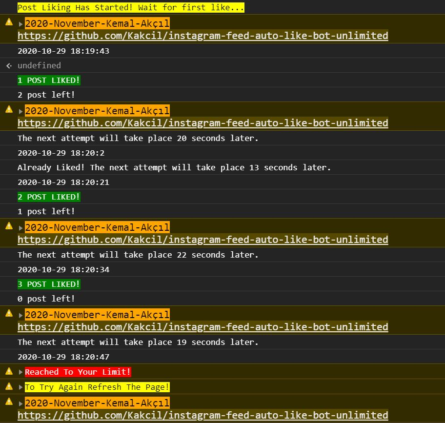

# instagram-feed-auto-like-bot-unlimited

Script for random unlimited automatic like for Instagram Web Feed.

It runs on new Instagram React version.

This code was created and tested by Kemal Akçıl in 2020, November.

# Output



# How to use
- Copy the code contained in this Repo. (instagram-feed-auto-like-bot-unlimited.js)
- Sign in to Instagram with a web browser.
- Open the Console.
- Paste the copied code into Console.
- Set the limit value in code according to your need.
```sh
const limit = 3;
```
- Press Enter.
- That's it! Sit back and enjoy it!

# Support
- Maybe you can help improve the code.
- At worst, you can give this repository a Star.

# Help
- You can send me an e-mail regarding any problem to me@kemalakcil.com.
